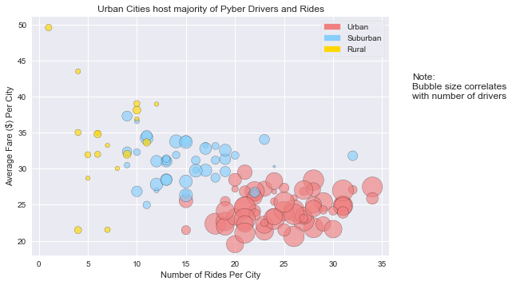
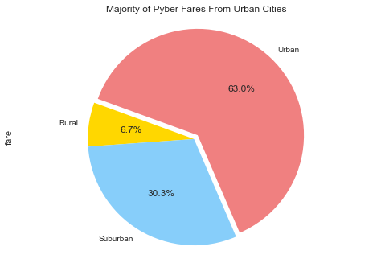
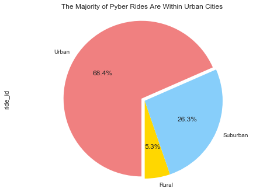
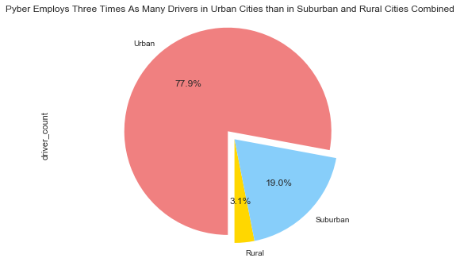

# Pyber
- The average fare is the greatest in rural cities, but also represents the smallest percentage of total fare, number of rides and number of drivers. If fare rate were lower in rural areas, would ride count increase?
- Increased ride count is positively correlated with increased driver count.
- Pyber employs three times as many drivers in urban cities than in suburban and rural cities combined


```python
import pandas as pd
import matplotlib.pyplot as plt
import numpy as np
import seaborn as sns
import matplotlib.patches as mpatches
```


```python
city = pd.read_csv("resources/city_data.csv")
ride = pd.read_csv("resources/ride_data.csv")
```


```python
city.head(3)
```


<div>
<style>
    .dataframe thead tr:only-child th {
        text-align: right;
    }

    .dataframe thead th {
        text-align: left;
    }

    .dataframe tbody tr th {
        vertical-align: top;
    }
</style>
<table border="1" class="dataframe">
  <thead>
    <tr style="text-align: right;">
      <th></th>
      <th>city</th>
      <th>driver_count</th>
      <th>type</th>
    </tr>
  </thead>
  <tbody>
    <tr>
      <th>0</th>
      <td>Kelseyland</td>
      <td>63</td>
      <td>Urban</td>
    </tr>
    <tr>
      <th>1</th>
      <td>Nguyenbury</td>
      <td>8</td>
      <td>Urban</td>
    </tr>
    <tr>
      <th>2</th>
      <td>East Douglas</td>
      <td>12</td>
      <td>Urban</td>
    </tr>
  </tbody>
</table>
</div>


```python
# remove the bad data record
city=city.drop(city.index[100])
city[city["city"]=="Port James"]
```


<div>
<style>
    .dataframe thead tr:only-child th {
        text-align: right;
    }

    .dataframe thead th {
        text-align: left;
    }

    .dataframe tbody tr th {
        vertical-align: top;
    }
</style>
<table border="1" class="dataframe">
  <thead>
    <tr style="text-align: right;">
      <th></th>
      <th>city</th>
      <th>driver_count</th>
      <th>type</th>
    </tr>
  </thead>
  <tbody>
    <tr>
      <th>84</th>
      <td>Port James</td>
      <td>15</td>
      <td>Suburban</td>
    </tr>
  </tbody>
</table>
</div>


```python
ride.head(3)
```


<div>
<style>
    .dataframe thead tr:only-child th {
        text-align: right;
    }

    .dataframe thead th {
        text-align: left;
    }

    .dataframe tbody tr th {
        vertical-align: top;
    }
</style>
<table border="1" class="dataframe">
  <thead>
    <tr style="text-align: right;">
      <th></th>
      <th>city</th>
      <th>date</th>
      <th>fare</th>
      <th>ride_id</th>
    </tr>
  </thead>
  <tbody>
    <tr>
      <th>0</th>
      <td>Sarabury</td>
      <td>2016-01-16 13:49:27</td>
      <td>38.35</td>
      <td>5403689035038</td>
    </tr>
    <tr>
      <th>1</th>
      <td>South Roy</td>
      <td>2016-01-02 18:42:34</td>
      <td>17.49</td>
      <td>4036272335942</td>
    </tr>
    <tr>
      <th>2</th>
      <td>Wiseborough</td>
      <td>2016-01-21 17:35:29</td>
      <td>44.18</td>
      <td>3645042422587</td>
    </tr>
  </tbody>
</table>
</div>


```python
# calculate average fare per city
avgFare = ride.groupby("city")["fare"].mean().to_frame("AvgFare")
avgFare["AvgFare"].nlargest(5)
```


    city
    Manuelchester    49.620000
    Matthewside      43.532500
    East Stephen     39.053000
    South Joseph     38.983333
    North Whitney    38.146000
    Name: AvgFare, dtype: float64


```python
cityRide = city.merge(ride)
avgFareByType = cityRide.groupby("type")["fare"].mean()
avgFareByType
```


    type
    Rural       34.040720
    Suburban    30.908608
    Urban       24.663594
    Name: fare, dtype: float64


```python
# calculate total ride per city
rideCount = ride.groupby("city")["ride_id"].count().to_frame("rideCount")
rideCount["rideCount"].nlargest(5)
```


    city
    Port Johnstad    34
    Swansonbury      34
    Port James       32
    South Louis      32
    Alvarezhaven     31
    Name: rideCount, dtype: int64


```python
# combine the data for plotting
summary = city.merge(avgFare, left_on="city", right_index=True).merge(rideCount, left_on="city", right_index=True)
summary.head(3)
```


<div>
<style>
    .dataframe thead tr:only-child th {
        text-align: right;
    }

    .dataframe thead th {
        text-align: left;
    }

    .dataframe tbody tr th {
        vertical-align: top;
    }
</style>
<table border="1" class="dataframe">
  <thead>
    <tr style="text-align: right;">
      <th></th>
      <th>city</th>
      <th>driver_count</th>
      <th>type</th>
      <th>AvgFare</th>
      <th>rideCount</th>
    </tr>
  </thead>
  <tbody>
    <tr>
      <th>0</th>
      <td>Kelseyland</td>
      <td>63</td>
      <td>Urban</td>
      <td>21.806429</td>
      <td>28</td>
    </tr>
    <tr>
      <th>1</th>
      <td>Nguyenbury</td>
      <td>8</td>
      <td>Urban</td>
      <td>25.899615</td>
      <td>26</td>
    </tr>
    <tr>
      <th>2</th>
      <td>East Douglas</td>
      <td>12</td>
      <td>Urban</td>
      <td>26.169091</td>
      <td>22</td>
    </tr>
  </tbody>
</table>
</div>


### Bubble Chart


```python
#rename the column for aesthetics in legend
# summary.rename(columns={"type":"City Type"}, inplace=True)

# apply colors to the unique city types
categories = np.unique(summary["type"])
# colors = np.linspace(0, 1, len(categories)) #if number of colors unknown, can use this to do gray scale
colors = ['gold','lightskyblue','lightcoral']
colordict = dict(zip(categories, colors))  

summary["color"] = summary["type"].apply(lambda x: colordict[x])

```


```python
fig = plt.figure()
ax = fig.add_subplot(1,1,1)
ax.scatter(summary["rideCount"], summary["AvgFare"], s=summary["driver_count"]*10, c=summary["color"], alpha=.65, edgecolors="k")
handles, labels = ax.get_legend_handles_labels()

plt.title("Urban Cities host majority of Pyber Drivers and Rides")
plt.xlabel("Number of Rides Per City")
plt.ylabel("Average Fare ($) Per City")

# manually make the legend
urbanPatch = mpatches.Patch(color=colors[2], label=categories[2])
subrurbanPatch = mpatches.Patch(color=colors[1], label=categories[1])
ruralPatch = mpatches.Patch(color=colors[0], label=categories[0])
plt.legend(handles=[urbanPatch, subrurbanPatch, ruralPatch], frameon=True, loc="upper right")
#add a note regarding the bubble size
plt.gcf().text(.95, 0.68, "Note:", fontsize=12, )
plt.gcf().text(.95, 0.65, "Bubble size correlates", fontsize=12)
plt.gcf().text(.95, 0.62, "with number of drivers", fontsize=12)
plt.show()
```





#### % of Total Fares by City Type


```python
fareTotal = cityRide.groupby("type")["fare"].sum()
# display in a pie chart - autopct automatically calculates the percentage so we don't have to!
colors = ['gold','lightskyblue','lightcoral']
fareTotal.plot(kind="pie", autopct="%1.1f%%", startangle=160, colors=colors, explode=(0,0,.05))
plt.axis("equal")
plt.title("Majority of Pyber Fares From Urban Cities")
plt.show()

```





```python

```

#### % of Total Rides by City Type


```python
summary.head(3)
# rideTypeCount = summary["City Type"].value_counts().to_frame("rideCount")
rideTypeCount = cityRide.groupby("type")["ride_id"].count()
colors = ['gold','lightskyblue','lightcoral']
rideTypeCount.plot(kind="pie",autopct="%1.1f%%", startangle=270, colors=colors, explode=(0,0,0.05))
# plt.pie(rideTypeCount["rideCount"], labels=rideTypeCount.index, autopct="%1.1f%%", startangle=270, colors=colors, explode=(.05,0,0))
plt.axis("equal")
plt.title("The Majority of Pyber Rides Are Within Urban Cities ")
plt.show()
```





#### % of Total Drivers by City Type


```python
# driverCount = summary.groupby("City Type")["driver_count"].sum()
# driverCount
driverCount = city.groupby("type")["driver_count"].sum()
colors = ['gold','lightskyblue','lightcoral']
driverCount.plot(kind="pie", autopct="%1.1f%%", startangle=270, colors=colors, explode=(0,0,.1))
# plt.pie(driverCount, labels=driverCount.index, autopct="%1.1f%%", startangle=270, colors=colors, explode=(0,0,.1))
plt.axis("equal")
plt.title("Pyber Employs Three Times As Many Drivers in Urban Cities than in Suburban and Rural Cities Combined")
plt.show()
```




